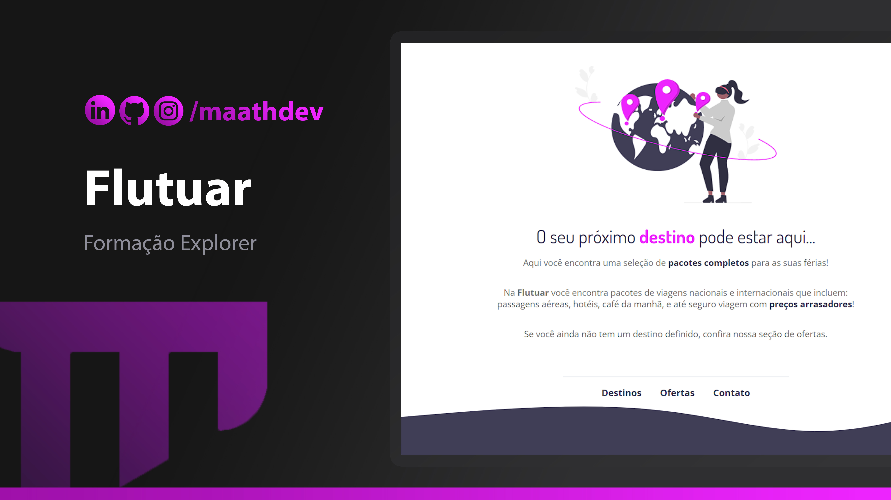

<h1 align="center"> Flutuar </h1>

Desafio proposto pelo programa de aprendizado da Rockeatseat e feito por MaathDev.  
<a style="color: #EE24FF;" href="https://instagram.com/maathdev">Entre em contato comigo.</a>

  <a style="color: #EE24FF;" href="#-tecnologias">Tecnologias</a>&nbsp;&nbsp;&nbsp;|&nbsp;&nbsp;&nbsp;
  <a style="color: #EE24FF;" href="#-projeto">Projeto</a>&nbsp;&nbsp;&nbsp;|&nbsp;&nbsp;&nbsp;

 

  

## 🚀 Tecnologias

Esse projeto foi desenvolvido com as seguintes tecnologias:

- HTML e CSS
- Git e Github
- Figma

## 💻 Projeto

O DevLinks é um agregador de links para usar como cartão de visitas online.

- [Acesse o projeto finalizado, online] <a style="color: #EE24FF;" href="https://maathdev.github.io/flutuar-desafio-explorer/">(https://maathdev.github.io/flutuar-desafio-explorer/)</a>

---

Feito com ♥ by Maath Dev :wave:
